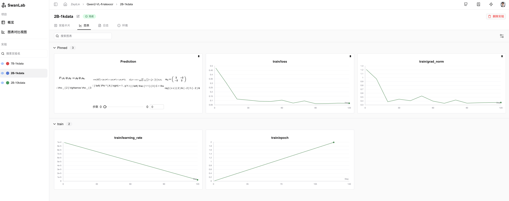

# 链接
https://wener.me/notes/ai  
ppo: https://yugeten.github.io/posts/2025/01/ppogrpo/  
vpn: https://kaola0.com/user  
RL数据格式：https://zhuanlan.zhihu.com/p/27941600074  
微调：https://qiankunli.github.io/2024/07/28/llm_finetune_practice.html#%E6%95%B0%E6%8D%AE%E5%87%86%E5%A4%87  
ocr_data:[olmOCR-mix-0225](https://modelscope.cn/datasets/allenai/olmOCR-mix-0225)  
# Qwen2-VL-finetune-LatexOCR

[](https://swanlab.cn/@ZeyiLin/Qwen2-VL-ft-latexocr/runs/1glks73k6u5gw98ovzwev/chart)

[教程文档](https://zhuanlan.zhihu.com/p/10705293665)｜[SwanLab过程](https://swanlab.cn/@ZeyiLin/Qwen2-VL-ft-latexocr/runs/1glks73k6u5gw98ovzwev/chart)

## 1. 环境配置

1. 确保你的电脑上至少有一张英伟达显卡，并已安装好了CUDA环境。
2. 安装Python（版本>=3.8）以及能够调用CUDA加速的PyTorch。
3. 安装与Qwen2-VL微调相关的第三方库，可以使用以下命令：

```
pip install modelscope transformers sentencepiece accelerate datasets peft swanlab qwen-vl-utils pandas
```

## 2. 数据准备

依次执行：

```bash
python data2csv.py
```

```bash
python csv2json.py
```

## 3. 开始微调

此时的目录结构为：

```
|———— train.py
|———— data2csv.py
|———— csv2json.py
|———— latex_ocr_train.csv
|———— latex_ocr_train.json
|———— latex_ocr_val.json
```

开始微调：

```bash
python train.py
```

在[SwanLab](https://swanlab.cn/)可以查看微调过程：[SwanLab过程](https://swanlab.cn/@ZeyiLin/Qwen2-VL-ft-latexocr/runs/1glks73k6u5gw98ovzwev/chart)


